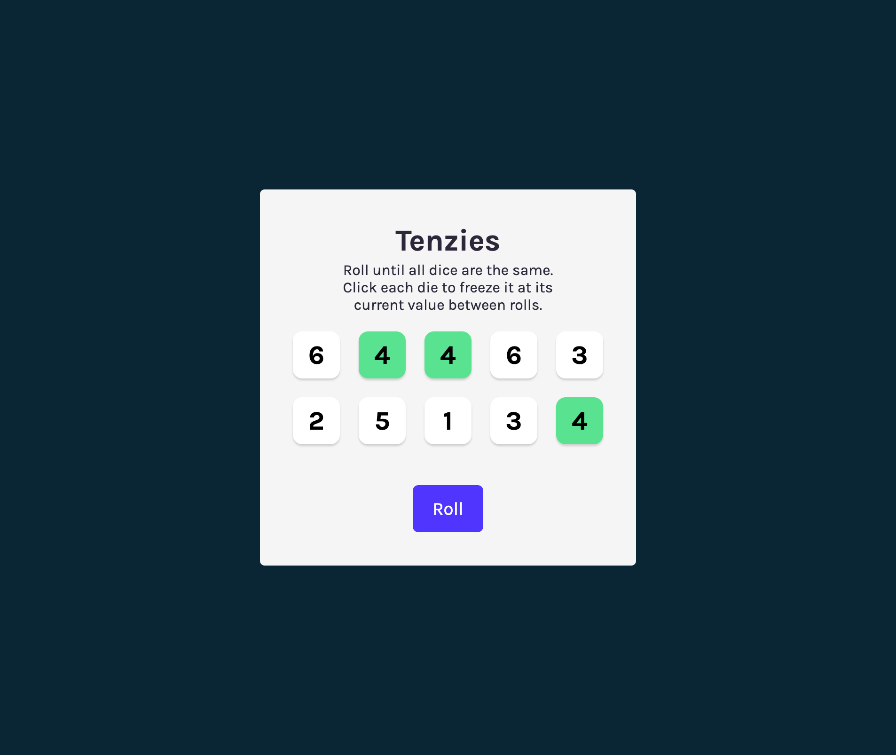

<p align="center">
  <h1 align="center">Tenzies – Dice Game (React)</h1>
  <p align="center">
  
  
  
</p>
</p>

Tenzies is a simple interactive dice game built using React.
The objective is to roll until all dice show the same value while strategically holding selected dice between rolls.

---

## Live Demo

[Play the game](https://tenzies-sooty-psi.vercel.app/)

---

## How to Play

- Roll the dice using the roll button
- Click on any die to hold its value
- Continue rolling until all dice match

---

## Features

- Dynamic dice generation
- Hold and unhold functionality
- Win condition detection
- Confetti feedback on completion

---

## Tech Stack

- React (Hooks)
- Vite
- nanoid
- react-confetti

---

## Running Locally

```bash
git clone https://github.com/Ash-the-k/Tenzies
cd Tenzies
npm install
npm run dev
```

---

## Project Structure

- `App.jsx` – Main game logic and state management
- `Die.jsx` – Individual die component
- `index.jsx` – Entry point
- `index.css` – Styling

---

## Deployment

Deployed on Vercel.

---

## Preview



## Notes

This project was built as part of a React learning exercise and refined for deployment and presentation.

---

## License

This project is licensed under the MIT License. See the [LICENSE](LICENSE) file for details.

---
